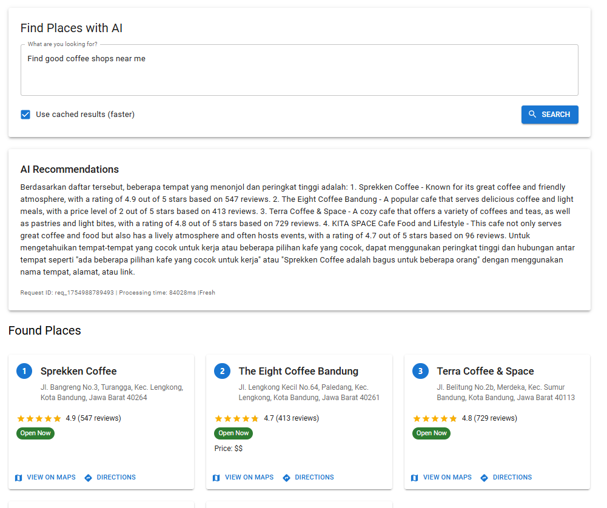
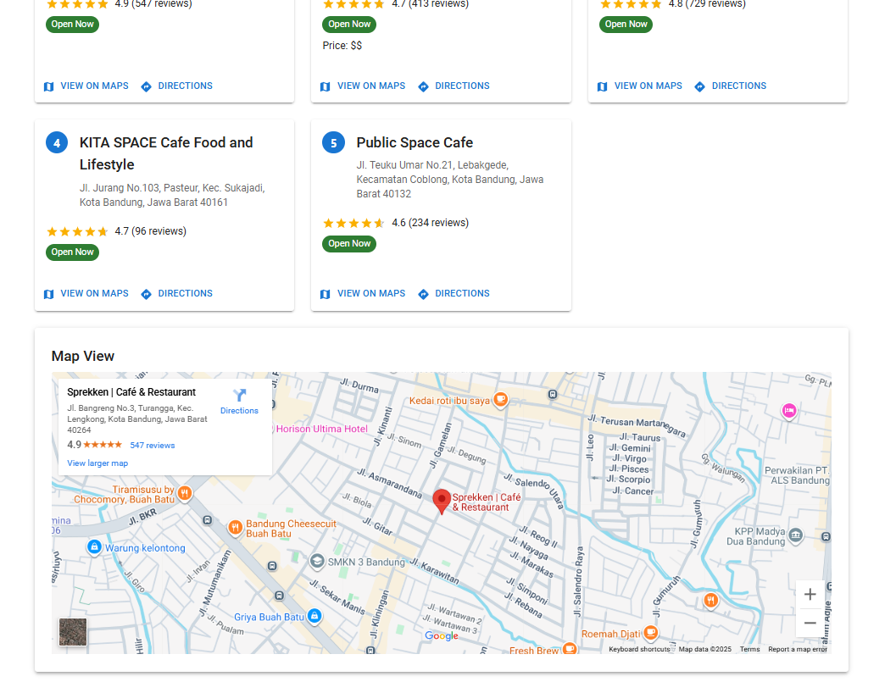
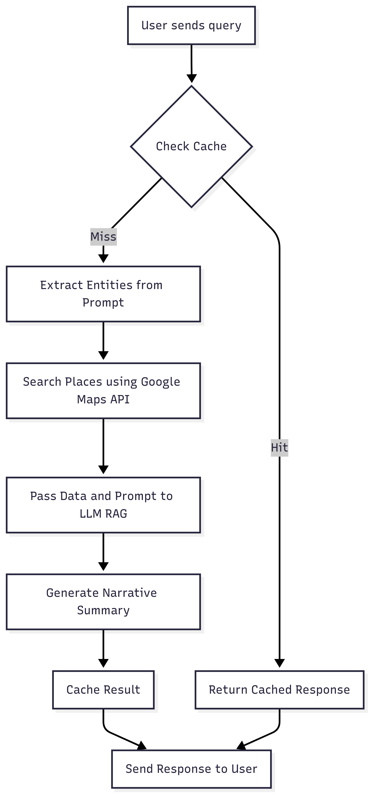

# LLM Maps Integration

A powerful local LLM-powered system for finding places using natural language queries, built with a React frontend and a Node.js backend. This project is optimized for Windows development and utilizes a local LLM, so you can leverage AI-powered search without relying on external cloud services.

---

## 🚀 Key Features

- **AI-Powered Search**: Uses a local LLM (Ollama) for natural language processing to understand complex queries.
- **Google Maps Integration**: Integrates with Google Maps Platform to provide accurate and validated place data, directions, and more.
- **Modern Stack**: Built with a **React** frontend, a **Node.js/Express** backend, and **TypeScript** for type safety.
- **Redis Caching**: Improves performance and reduces API calls with an intelligent caching layer.
- **Docker Support**: Provides a `docker-compose` setup for streamlined deployment and scaling.

---

## 🌐 Live Demo & API

You can try the deployed version running on Google Cloud Platform with spec e2-standard-4 (4 vCPUs, 16 GB Memory):

- **Demo UI**: [https://heypico-demo.fikrialfaraby.com/](https://heypico-demo.fikrialfaraby.com/)
- **API Base URL**: [https://heypico-demo.fikrialfaraby.com/api](https://heypico-demo.fikrialfaraby.com/api)
- **API Documentation (Swagger UI)**: [https://heypico-demo.fikrialfaraby.com/api-docs](https://heypico-demo.fikrialfaraby.com/api-docs)

> **Note:**  
> The LLM model is deployed locally and exposed via **ngrok** tunnel because Google Cloud Run currently does not support GPU quota increase for NVIDIA A100/14 GPUs without approval, which is required to run the model efficiently in the cloud.

---

## 📷 Demo Preview



  
_Try natural language queries like “Find good coffee shops near me” or “Best tourist spots in Jakarta”_

---

## 🛠️ Quick Start (Windows)

### Prerequisites

- Windows 10/11 (64-bit)
- **Node.js** (v18 or higher)
- **Docker Desktop for Windows**
- **Git for Windows**
- **Ollama for Windows**

### Setup

```powershell
git clone https://github.com/FikriAlfaraby/llm-maps-integration
cd llm-maps-integration
Copy-Item .env.example .env
notepad .env  # Add your Google Maps API key here
```

### Run

Open two terminals:

**Backend**

```powershell
cd backend
npm run dev
```

**Frontend**

```powershell
cd frontend
npm start
```

Access:

- Frontend: `http://localhost:3000`
- Backend API: `http://localhost:5000/api`
- API Docs: `http://localhost:5000/api-docs`

---

## 🔍 Logical Flow - Query Processing

The main query processing uses a **RAG (Retrieval-Augmented Generation)** approach:

1. Extract entities from user prompt
2. Retrieve relevant place data from Google Maps API
3. Generate narrative summary using LLM
4. Cache results to speed up repeated queries

### Flowchart



---

## ⚙️ Configuration

Adjust `.env` variables as needed:

```env
# Google Maps API key
Maps_API_KEY=your_api_key_here

# LLM model to use with Ollama
LLM_MODEL=mistral:7b-instruct-q4_0

# Ports for backend and frontend
PORT=5000
CLIENT_PORT=3000

# Redis connection details
REDIS_HOST=localhost
REDIS_PORT=6379
```

---

## 🚢 Deployment

Use Docker Compose for production:

```powershell
docker-compose up -d
docker-compose down
```

---

## 📝 Additional Notes on LLM Deployment

- The LLM model currently runs locally or on a GPU-enabled machine.
- For the demo, the LLM service is exposed securely via **ngrok** tunneling.
- Google Cloud Run does not yet support required GPU quota for this model; quota increase requests require Google approval.
- When deploying on your own infrastructure with GPU support, you can modify `.env` accordingly.

---

## Code Snippet: Query Handler

```js
/**
 * Handles the main query processing flow using a RAG (Retrieval-Augmented Generation) approach.
 * It extracts entities from the prompt, retrieves relevant data, and uses an LLM to generate a narrative.
 * @param {object} req - The Express request object.
 * @param {object} res - The Express response object.
 */
const processQuery = async (req, res) => {
  const startTime = Date.now();
  const requestId = `req_${Date.now()}`;

  try {
    const {
      prompt,
      user_location,
      max_results = 5,
      use_cache = true,
    } = req.body;

    const cacheKey = [prompt, JSON.stringify(user_location)];
    if (use_cache) {
      const cachedResult = await cacheService.get(...cacheKey);
      if (cachedResult) {
        logger.info(`[${requestId}] Using cached result.`);
        return res.json({
          ...cachedResult,
          cached: true,
          request_id: requestId,
          processing_time: Date.now() - startTime,
        });
      }
    }

    logger.info(
      `[${requestId}] Processing query with RAG approach: "${prompt}"`
    );

    // Replace the entire extraction, search, and summary flow with a single RAG call.
    const recommendation =
      await llmService.findPlacesAndGenerateNarrativeWithRAG(
        prompt,
        user_location,
        max_results
      );

    if (!recommendation) {
      return res.status(404).json({
        error: "No recommendations found.",
        request_id: requestId,
      });
    }

    const responseData = {
      llm_text: recommendation.llm_text,
      places: recommendation.places,
      request_id: requestId,
      cached: false,
      processing_time: Date.now() - startTime,
    };

    if (use_cache) {
      await cacheService.set(responseData, 1800, ...cacheKey);
    }

    logger.info(`[${requestId}] Finished in ${responseData.processing_time}ms`);
    res.json(responseData);
  } catch (error) {
    logger.error(`[${requestId}] Query processing failed:`, error);
    res.status(500).json({
      error: "Failed to process query",
      request_id: requestId,
    });
  }
};
```
